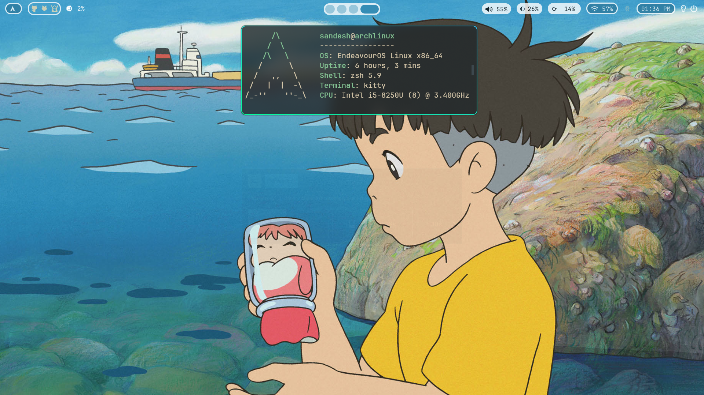
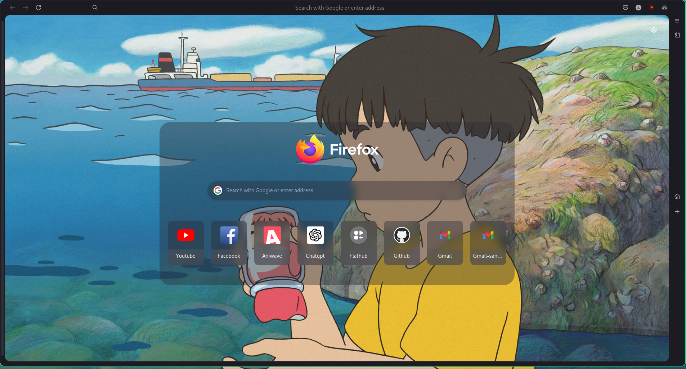
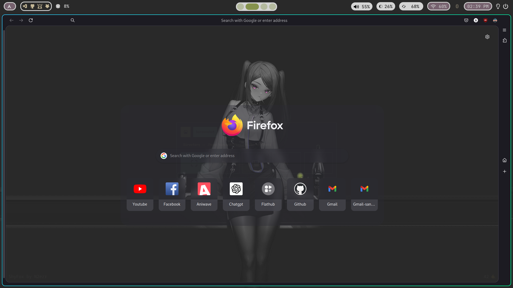
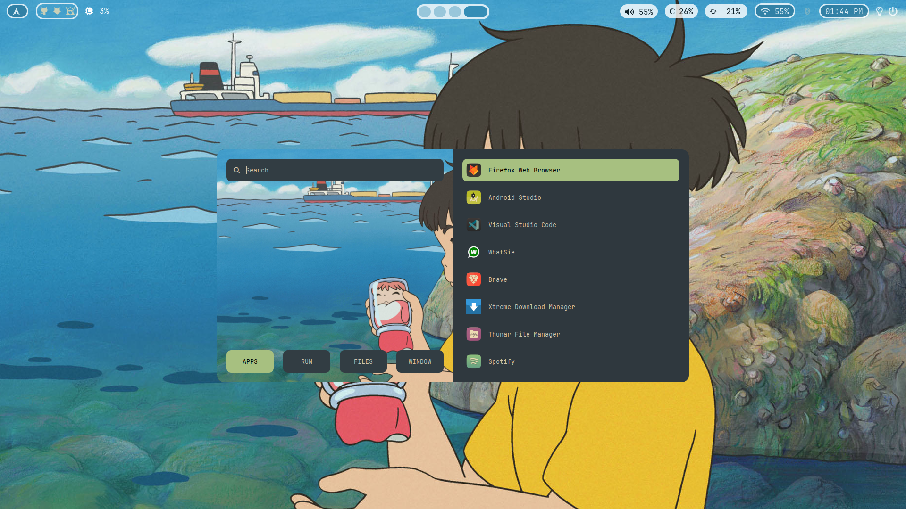
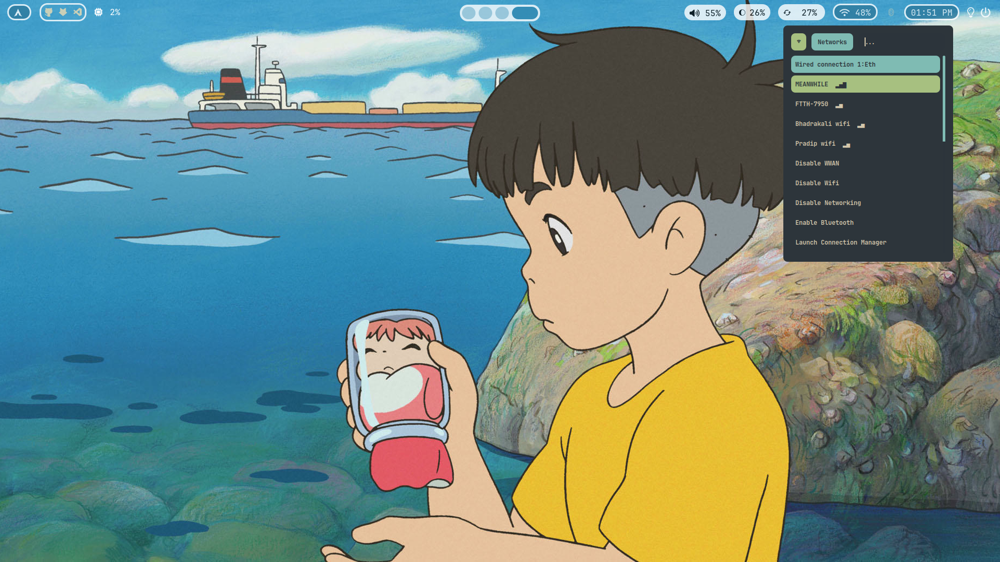
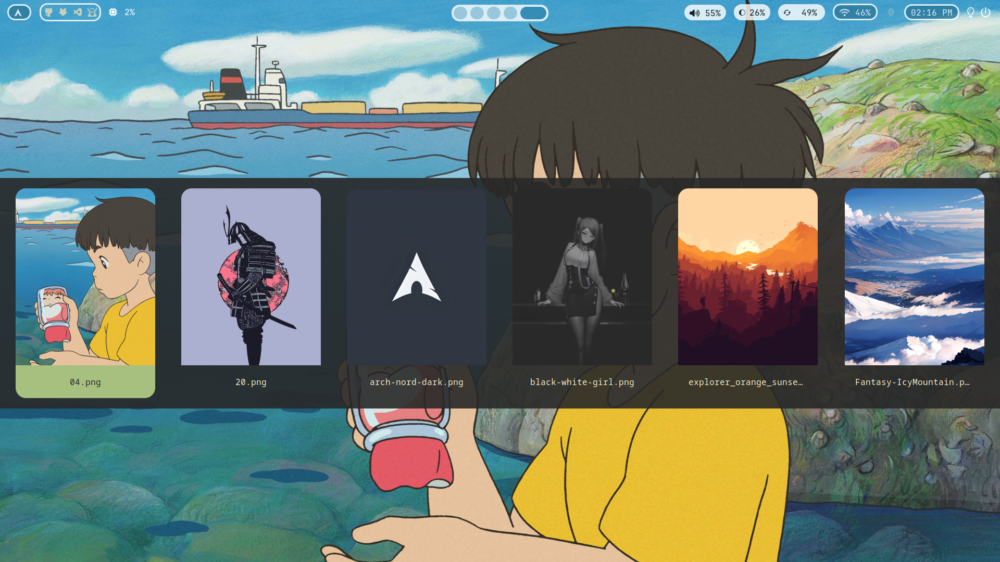
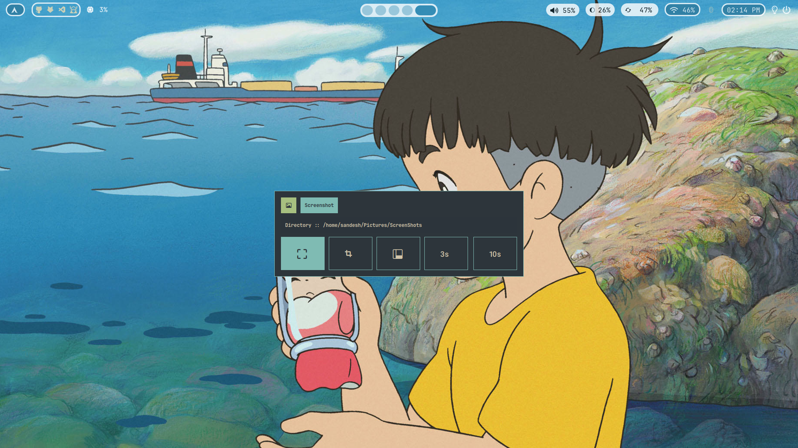
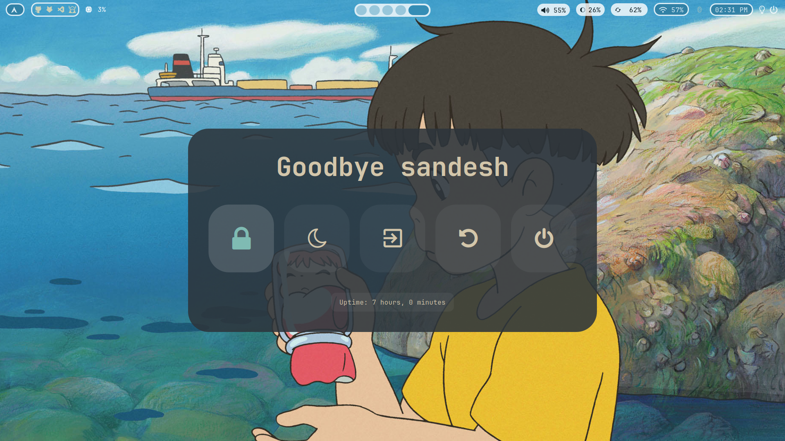
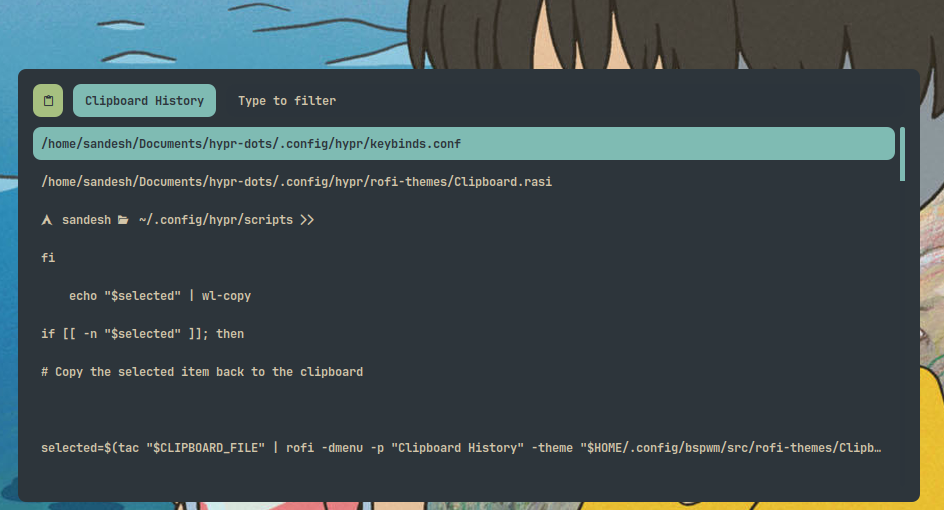
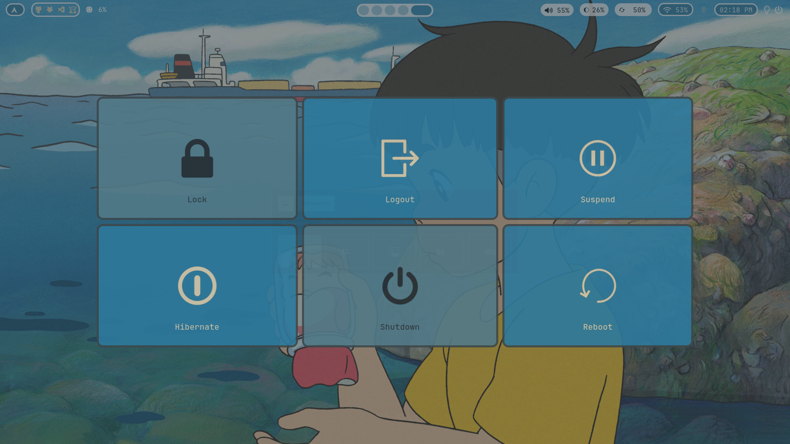

# hypr-dots
 My minimal hyprland with Everforest gtk theme, Gruvbox plus icons and pywal. nothing fancy! 

# Configurations:

###  Core System Info

<!-- The rice codename is **Artemis** 🏹, named after the Greek goddess of the hunt and the wild. -->

- **OS**: [Arch Linux](https://archlinux.org/) :boom:
- **WM**: [hyprland](https://hyprland.org/) :window:
- **Shell**: [zsh](https://fishshell.com/) :shell:
- **Terminal Emulator**: [kitty](https://sw.kovidgoyal.net/kitty/) :cat:
- **Panel**: [waybar](https://github.com/Alexays/Waybar) :shaved_ice:
- **Text Editor**: [neovim](https://neovim.io/) :keyboard:
- **App Launcher**: [rofi](https://davatorium.github.io/rofi/) :rocket:
- **File Manager**: [thunar](https://yazi-rs.github.io/) :open_file_folder:
- **Browser**: [Firefox](https://floorp.app/en) :globe_with_meridians:
- **Notification Manager**: [dunst](https://github.com/ErikReider/SwayNotificationCenter) :bell:
- **Colorscheme**: [Everforest](https://github.com/catppuccin/catppuccin) :art:

---

### 🐧 Whole System Info

Here is all the information about my Laptop:

  
<b>🐧 System</b>

| 📚 Entry                       | ✨ App                                                                                                                                       |
| ------------------------------ | -------------------------------------------------------------------------------------------------------------------------------------------- |
| **OS**                         |  [Arch Linux](https://archlinux.org/)                                                                                                      |
| **Package Manager**            | [pacman](https://wiki.archlinux.org/title/Pacman)                                                              |
| **AUR Helper**                 |  [yay](https://github.com/Jguer/yay)                                                                          |
| **Display Manager**            | [sddm](https://sr.ht/~kennylevinsen/greetd/) (with [corner](https://github.com/apognu/tuigreet))                                         |
| **Window Manager**             |  [hyprland](https://hyprland.org/) [:gear:](../.config/hypr/)                                                                              |
| **Notification Daemon/Center** | [dunst](https://github.com/ErikReider/SwayNotificationCenter)                                               |
| **Bar**                        |  [waybar](https://github.com/Alexays/Waybar) [:gear:](../.config/waybar/)                                                                  |
| **Application Launcher**       | [rofi](https://github.com/lbonn/rofi)                                                                       |
| **Firewall**                   | [ufw](https://wiki.archlinux.org/title/ufw)                                                                                                  |
| **Clipboard Manager**          | [wl-clipboard](https://github.com/bugaevc/wl-clipboard)                            |
| **Wallpaper Switcher**         | [swww](https://github.com/Horus645/swww)                                                                                                     |
| **Lock Screen**                | [hyprlock](https://github.com/hyprwm/hyprlock) [:gear:](../.config/hypr/hyprlock.conf)                                                       |
| **Idle Timeout**               | [hypridle](https://github.com/hyprwm/hypridle) [:gear:](../.config/hypr/hypridle.conf)                                                       |
| **Screenshot Tool**            | [grim](https://sr.ht/~emersion/grim/)|

  
<b>🖱️ GUI Apps</b>

| 📚 Entry                 | ✨ App                                                                                                                  |
| ------------------------ | ----------------------------------------------------------------------------------------------------------------------- |
| **Music Player**         | [Spotify](https://open.spotify.com/) (patched with [Spicetify](https://spicetify.app/)) [:gear:]|
| **Fallback Text Editor** | [Vscode](https://vscodium.com/) [:gear:]                                                 |
| **Web Browser**          | [Firefox](https://floorp.app/en/) [:gear:]                                                       |
| **PDF Viewer**           | [Zathura](https://pwmt.org/projects/zathura/) [:gear:]                                             |
| **File Manager**         | [Thunar](https://community.linuxmint.com/software/view/nemo)                                                              |

## Screenshots
### Desktop:

### Firefox [shyfox-theme] :

  #### Firefox / waybar [with other wallpaper] :
  

### Rofi Launcher:

### Rofi network manager :

### Rofi Wallpaper selector :

### Rofi Screenshot :

### Rofi Powermenu :

### Rofi Clipboard :

### Wlogout :

### Waybar:
