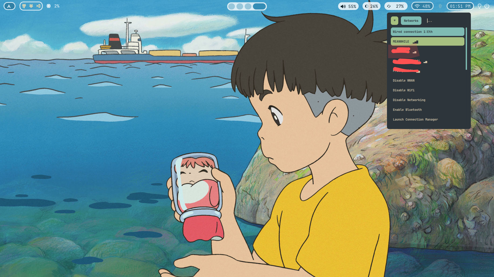

# hypr-dots
 My minimal hyprland with Everforest gtk theme, Gruvbox plus icons and pywal. nothing fancy! 

## Screenshots
### Desktop:

### Firefox [shyfox-theme] :

  #### Firefox / waybar [with other wallpaper] :
  

### Rofi Launcher:

### Rofi network manager :

### Rofi Wallpaper selector :

### Rofi Screenshot :

### Rofi Powermenu :

### Wlogout :

### Waybar:
